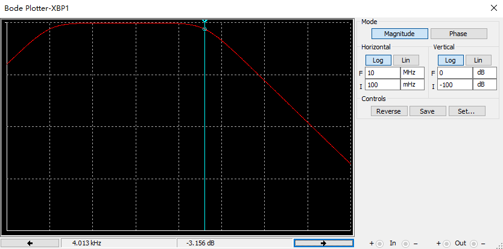

# 无源带通滤波电路设计报告

## 设计电路

带通滤波器参数：

$R_1=10\ \mathrm{k\Omega}$​​​​，$R_2=12\ \mathrm{k\Omega}$​​​​，$R_3=1\ \mathrm{k\Omega}$​​​​，$C_1=22\ \mathrm{\mu F}$​​​​，$C_2=33\ \mathrm{nF}$​​​​，低截止频率$f_L=2\pi\cdot R_1||R_2 \cdot C_1\approx 1\ \mathrm{Hz}$​​​​，高截止频率$f_H=2\pi\cdot R_3 C_2\approx 4\ \mathrm{kHz}$​​​​，中心频率$f_C=\sqrt{f_L\cdot f_H}\approx 63Hz$​​​​。

## 电路频率响应分析

电压传递函数：
$$
H(s)=\frac{R_1 C_1 s}{(R_1 R_2 C_1 C_2 ) s^2+(R_1 C_1+R_1 C_2+R_2 C_2 )s+1}
$$
幅频曲线如图2。可以看出，在高截止频率$f_H$处幅值开始以$-20\ \mathrm{dB}$​斜率衰减。

图2. 无源带通滤波器幅频曲线

