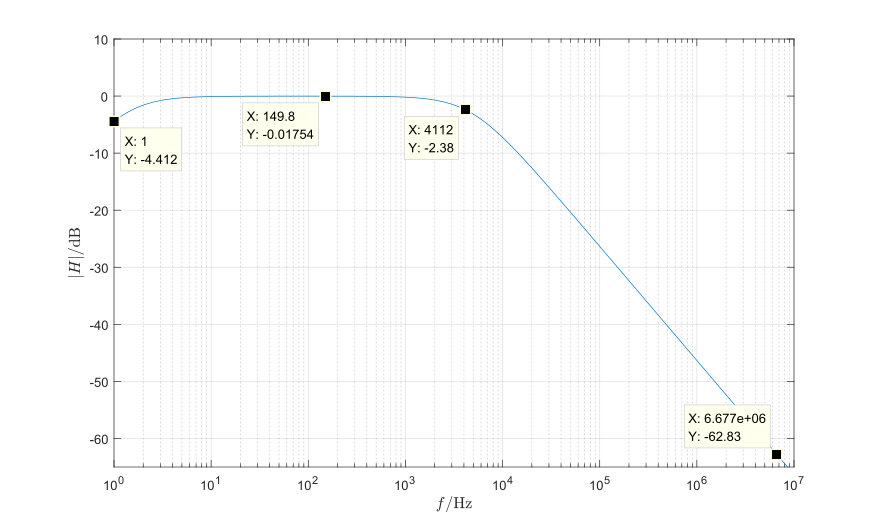

# 无源带通滤波电路设计报告

## 设计电路

图1. 无源带通滤波器电路

带通滤波器参数：

$R_1=10\ \mathrm{k\Omega}$，$R_2=12\ \mathrm{k\Omega}$，$R_3=1\ \mathrm{k\Omega}$，$C_1=22\ \mathrm{\mu F}$，$C_2=33\ \mathrm{nF}$，低截止频率$f_L=\frac{1}{2\pi\cdot R_1||R_2 \cdot C_1} \triangleq \frac{1}{2\pi\cdot \tau_L} \approx 1.33\ \mathrm{Hz}$，高截止频率$f_H=\frac{1}{2\pi\cdot R_3 C_2} \triangleq \frac{1}{2\pi\cdot \tau_H} \approx 4.82\ \mathrm{kHz}$，中心频率$f_C=\sqrt{f_L\cdot f_H}\approx 79.98\ \mathrm{Hz}$。

## 电路静态工作点分析

$C_1$作为隔直电容，隔离输入电压直流分量，$R_1$、$R_2$构成的分压电路将$C_1$右侧电压抬升至$1.5\ \mathrm{V}$。$D_1$是一个齐纳二极管，反向击穿电压$U_{r}=3\ \mathrm{V}$，在静态工作点处不导通，因此滤波电路的输出端静态电压$U_o$同样为$1.5\ \mathrm{V}$。

## 电路暂态分析

该带通虑波电路在初始上点时，$C_1$​还没有正向偏执电压，由于$C_1$​容值高，输入端的高电压会瞬间传导到输出端，因此须在输出端增加一个过压保护电路，保护输出端后级电路。齐纳二极管$D_1$​在电压超过反向击穿电压$U_{r}=3\ \mathrm{V}$​时会反向击穿，与$R_3$​串联构成一个过压保护电路，此时$C_1$​的充电电流、充电时间主要由$R_3$​的阻值决定，该过程时间常数$\tau=R_3 C_1=22\ \mathrm{ms}$​。当$C_1$​充电完成进入稳态后，输出端静态电压$U_o=1.5\ \mathrm{V}$​，$D_1$​处于反向截止状态。

## 电路频率响应分析

$R_1||R_2$与$C_1$构成了一个高通滤波器，滤除$1.33\ \mathrm{Hz}$以下频率的信号；$R_3$、$C_2$组成一个低通滤波电路，滤除$4.82\ \mathrm{kHz}$以上频率的信号。

电压传递函数：
$$
\begin{split}
H(s)&=\frac{R_1||R_2 C_1 s}{(R_1||R_2 R_3 C_1 C_2 ) s^2+[R_1||R_2 (C_1+C_2)+R_3 C_2]s+1}\newline
&\approx\frac{\tau_L s}{\tau_L \tau_H s^2+(\tau_L+\tau_H)s+1}
\end{split}
$$
幅频曲线如图2。可以看出，在高截止频率$f_H$处幅值开始以$-20\ \mathrm{dB}$​斜率衰减。

图2. 无源带通滤波器幅频曲线

滤波器阻抗：
$$
Z=\frac{R_1||R_2 R_3 C_1 C_2 s^2 + [R_1||R_2 (C_1 + C_2) + R_3 C_2]s + 1}{(R_1||R_2+R_3) C_1 C_2 s^2 + C_1 s}
$$

图3. 频率——输入阻抗曲线

